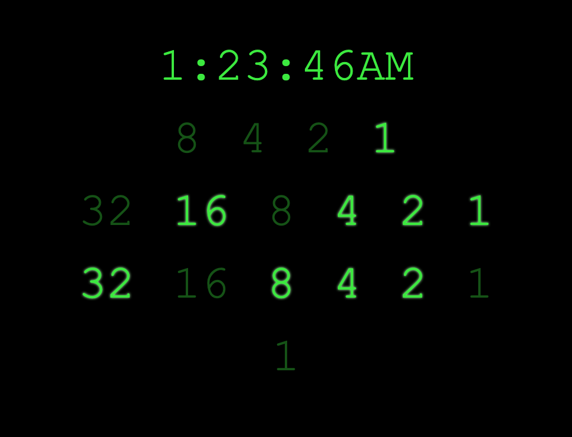

# Qwik Binary Clock

Everyone loves new JS frameworks.

I built a simple binary clock using the hot new Qwik framework, mostly to get a feel for how it handles state. This thing has a constant initial bundle size of 1kb. What kind of wizardry is this?

I gotta say, it's pretty cool. Not too different from react/next. I got the idea to do a binary clock from a leetcode problem lol.

[see my other projects here](https://github.com/thomasfoydel)
